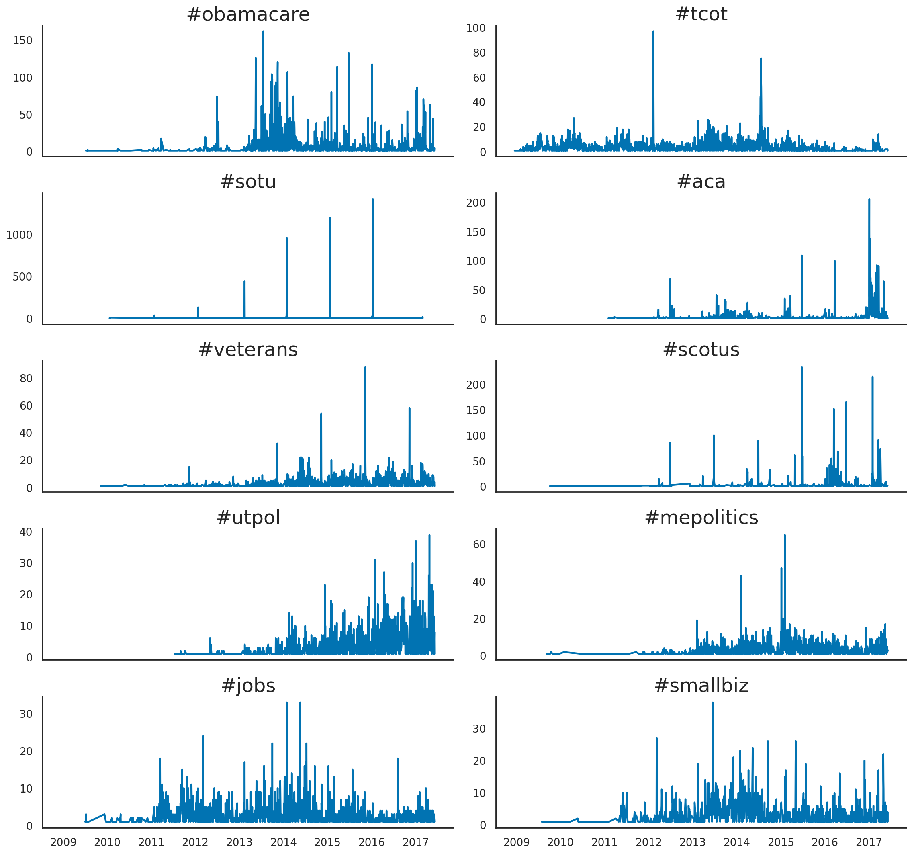

<style>
/* Chart Wrapper: Center charts and text */
.chart-wrapper {
    display: flex;
    flex-direction: column;
    align-items: center;
    margin: 0 auto;
    max-width: 900px;
}

/* Global Wrapper: Center all page content */
.page-wrapper {
    display: flex;
    flex-direction: column;
    align-items: center; /* Center content horizontally */
    margin: 0 auto; /* Center the wrapper itself */
    max-width: 900px; /* Match the text dimensions */
    padding: 20px; /* Add spacing around the edges */
    box-sizing: border-box;
}

/* Text Container: Style the text block */
.text-container {
    text-align: left;
    margin: 20px auto;
    max-width: 1200px;
    line-height: 1.4;
    font-size: 22px;
    font-family: "Calibri", Arial, sans-serif;
}

.body{
  max-width: 900px;
  margin: 20px auto;
  max-width: 1200px;
}

svg {
    max-width: 100%; /* Ensure the SVG scales within its container */
    height: auto;    /* Maintain aspect ratio */
  }
</style>

<div class="chart-wrapper">
  <div class="text-container">
   <h2>Hashtags</h2>
  <p>
  There were 79710 of distinct hashtags in the dataset. Below you see the top 20 most used hashtags. Hashtags are often used in conjunction with other hashtags. The most used combinations are shown in the second plot. Hashtags are used differently over time. Below you'll find the usage patterns of the top 10 hashtags over time.
  </p>
  </div>
</div>


```js
const data_hash = await FileAttachment("./data/hash_count.csv")
  .csv({ typed: true })
  .then(rawData => 
    rawData
      .map(d => ({
        hashtag: d.hashtag,
        count: +d.count // Ensure count is a number
      }))
      .sort((a, b) => b.count - a.count) 
      .slice(0, 20) // Take the top 50 rows
  );
```


```js
function hashPlot(data, {width}) {
  return Plot.plot({
    marginLeft: 140,
    marginBottom: 10,
    x: {
      axis: null,
    },
    y: { label: "" },
    color: { scheme: "YlOrRd" },
    marks: [
      Plot.barX(data, {
        x: "count",
        y: "hashtag",
        fill: "count",
        sort: { y: "x", reverse: true }
      }),
      // Add count labels inside the bars
      Plot.text(data, {
        x: "count", // Align the text position based on count
        y: "hashtag", // Align text to the y-axis
        text: (d) => d3.format(",")(d.count), // Format count as text with commas
        fill: (d) => (d.count > 7000 ? "white" : "black"), // Set text color to white for visibility
        fontSize: 7,
        textAnchor: "end", // Align text to the end of the bar
        dx: -6, // Adjust text position slightly inside the bar
        dy: 4,
      }),
      Plot.ruleX([0])
    ]
  })}

```

<div class="card">
  ${resize((width) => hashPlot(data_hash, { width }))}
</div>


<div class="chart-wrapper">
  <div class="text-container">
   <h2>Hashtags Combinations</h2>
  <p>
You may sort the columns by hashtag 1 to see for example how hashtag 1 was used in conjuction with other hashtags.
  </p>
  </div>
</div>

```js
import * as Inputs from "npm:@observablehq/inputs";
import * as htl from "npm:htl";

// Load and parse the CSV file
const data_hashcombo = await FileAttachment("./data/hash_combinations.csv")
  .csv({ typed: true })
  .then(rawData =>
    rawData.map(d => ({
      hash1: d.hash_1,
      hash2: d.hash_2,
      count_comb: +d.count,
      count1: +d.hash_1_count
    }))
  );

```

```js

// Display a table with formatted bars for "count_comb"
const hash_table = Inputs.table(data_hashcombo, {
  select: false,
  rows: 20,
  sort: "count_comb", 
  reverse: true,
  columns: ["hash1", "hash2", "count_comb"], // Columns to display
  header: {
    hash1: "Hashtag 1",
    hash2: "Hashtag 2",
    count_comb: "Count Combination"
  },
  format: {
    count_comb: sparkbar(d3.max(data_hashcombo, d => d.count_comb)) // Use a custom bar renderer
  }
});

function sparkbar(max) {
  return (x) => {
    const isOutside = x < max * 0.3; 
    return htl.html`
      <div style="
        position: relative;
        display: flex;
        align-items: center;
        height: 24px; 
      ">
        <!-- Bar -->
        <div style="
          background: var(--theme-green); /* Bar color */
          color: ${isOutside ? 'black' : 'white'}; /* Text color */
          font: 10px/1.7 var(--sans-serif); /* Font styling */
          width: ${100 * x / max}%; /* Bar width */
          height: 100%; /* Fill parent container height */
          padding: 2px 5px; /* Add padding for spacing */
          box-sizing: border-box;
          display: flex;
          align-items: center;
          justify-content: ${isOutside ? 'start' : 'end'}; 
        ">
          ${!isOutside ? x.toLocaleString("en-US") : ""}
        </div>

        <!-- Label Outside (conditionally rendered) -->
        ${isOutside
          ? htl.html`<span style="
               position: absolute;
              //  align-items: center;
               padding: 2px 5px;
               display: flex;
               left: calc(${100 * x / max}% + 10px); 
               top: 50%; /* Center vertically */
               transform: translateY(-50%);
               justify-content: 'start';
               white-space: nowrap; /* Prevent text wrapping */
               color: black; /* Label color */
               font: 10px/1.7 var(--sans-serif);
             ">
             ${x.toLocaleString("en-US")}
           </span>`
          : ""}
      </div>
    `;
  };
}


```


<div class="chart-wrapper">
  <div class="text-container">
${display(hash_table)}
  </div>
</div>


<div class="chart-wrapper">
  <div class="text-container">
    <h2>Top 10 Hashtags over Time</h2>
    <p>
      Hashtags of interest can be tracked over time to gauge the importance of topics. Some hashtags pop up and vanish 
      while others recur regularly. And then there are topics like jobs and business which are continuous burners. But 
      the most references were made to the health care system, coded with "#ACA" and "#Obamacare". There is an alleged  connection between #smallbiz and the health care system. Some reading of the tweets suggests the Republicans accused the Democrats health care plans to hurt small businesses. 
    </p>
    <br>
    <details>
      <summary>Hashtag Explanations</summary>
      <div class="details-text">
        <p>
          <strong>"Obamacare"</strong> is the same as <strong>"ACA"</strong> and means the Affordable Care Act. It helps 
          to provide low-income households with affordable health insurance. This is apparently an important topic for Americans.
        </p>
        <p>
          <strong>"TCOT"</strong> stands for Top Conservatives On Twitter and is a distinguishing mark for Republicans.
        </p>
        <p>
          <strong>"SOTU"</strong> is the State of the Union Address, an <strong>annual</strong> message delivered by the 
          president to a joint session of the US Congress.
        </p>
        <p>
          The Supreme Court Of The United States, <strong>"SCOTUS"</strong>, is the highest court in the land and the 
          final judge in matters of interpreting both the Constitution and all cases involving the laws passed by Congress. 
          It has been said that the nomination and confirmation process has become highly politicized in the last few decades, 
          with parties trying to get their Republican or Democratic-leaning judge into the court.
        </p>
        <p>
          <strong>"UTPOL"</strong> is short for Utah politics but really refers to the 
          <a href="https://www.nga.org/disagree-better/" target="_blank" rel="noopener noreferrer">"Disagree Better"</a> 
          initiative of Utah governors to promote a less polarized political dialogue.
        </p>
        <p>
          <strong>"MEPOLITICS"</strong>: Maine politics. Maine is a state in the northeast of the US with borders to Canada.
        </p>
      </div>
    </details>
  </div>
</div>


<div class="chart-wrapper">
  <div class="text-container">

  </div>
</div>

